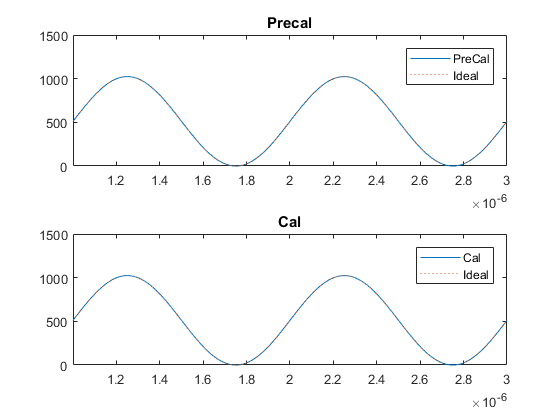
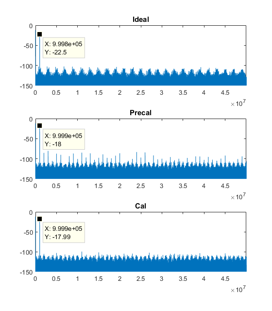
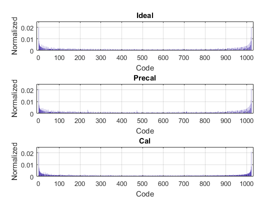
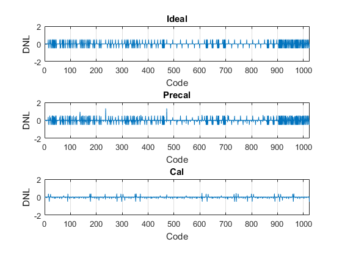
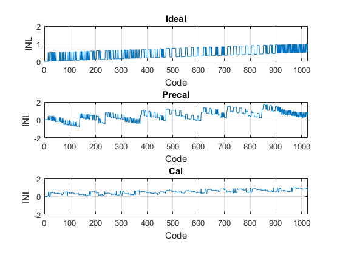
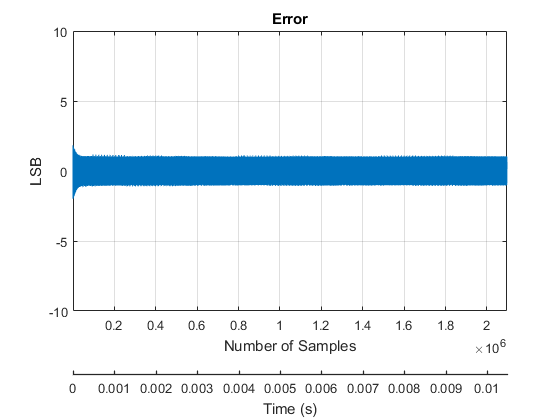
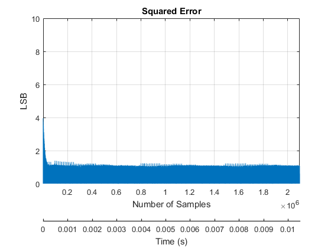
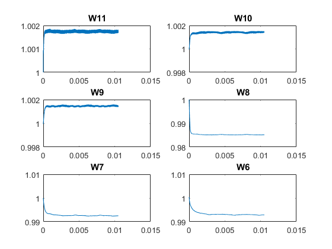
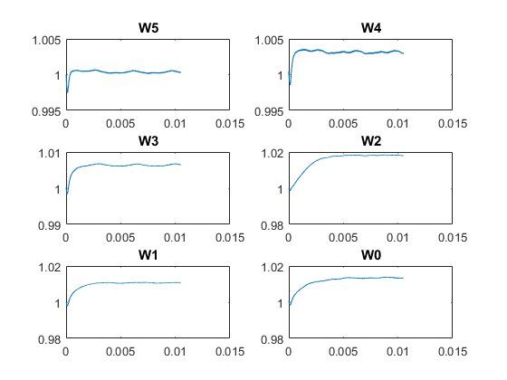

# matsar
Matlab script for performing LMSE calibration/nonlinearity measurements.

### Useful Input Parameters

| Symbol    | Default Value  | Full Name                 |
|-----------|--------|---------------------------|
| F         | 1MHz   | Input Sine Wave Frequency |
| Fs        | 200MHz | ADC Sampling Frequency    |
| FullScale | 1.2V   | Full Scale Input Voltage  |
| N         | 10     | 10-bits ADC               |
| M         | 12     | 12 steps for redundancy.  |
| Cmin      | 1fF    | Unit capacitance		     |
| C_mask    | [array]| Used to toggle capacitors |
| Cpar_mult    | [array]| Apply multiplicative factor to each capacitor. |
| Cpar_add    | [array]| Apply additive factor to each capacitor. |
| Carray    | [array]| SAR capacitor array. |
| mu    | 1e-4 | LMSE training rate. Not applicable for 'AdaDelta'.|
| mode    | 'AdaDelta' | LMSE SGD method. Valid values are 'AdaDelta','AdaGrad' and 'Constant'.|
| Gamma    | 0.7 | Tuning parameter for AdaDelta. |

### Useful Output Parameters
Availabe in Workspace after running the script.

| Symbol    | Default Value  | Full Name                 |
|-----------|--------|---------------------------|
| F         | 999928Hz   | Input Sine Wave Frequency |
| Ts         | 5ns   | Sampling interval = 1/Fs. |
| tend         | 10.5ms   | Input Sine Wave end time. |
| Input         | [array]   | Input waveform. |
| nsampmin         | 1070679   | Number of samples required for DNL/INL measurements. See Doernberg [1]. |
| numsamp         | 999928   | Number of samples required for DNL/INL measurements. |
| W         | [array]   | Trained weights. |
| codes_ideal         | [array]   | Ideally converted codes. |
| codes_precal         | [array]   | Converted codes with mismatch. |
| codes_cal         | [array]   | Calibrated codes with mismatch. |
| Rdn         | [array]   | Redundancy at each conversion step. |
| Regs         | [matrix]   | Ideal register values. The nth row is the register for sample n. Each register is a M-element row vector.|
| Regs_mis         | [matrix]   | Mismatched register values. The nth row is the register for sample n. Each register is a M-element row vector.|

### Sample Output
This sample output is the result of simulating a 12 steps 10-bit SAR ADC (default parameters). Default parasitics are extracted from TSMC 65nm into the 'Cpar_add' array.

```matlab
Calculated input frequency is F=999928(Hz)
SNR(Ideal) = 61.911478
SFDR(Ideal) = 84.559386
ENOB(Ideal) = 9.991940
SNR(Precal) = 54.433850
SFDR(Precal) = 62.408115
ENOB(Precal) = 8.749809
SNR(Cal) = 61.504055
SFDR(Cal) = 81.749704
ENOB(Cal) = 9.924262
```
#### Time Domain Waveforms


#### FFT Spectrum


#### Histogram


#### Differential Non-linearity (DNL)


#### Integral Non-linearity (INL)


#### Error


#### Squared Error


#### LMSE Trained Weights

