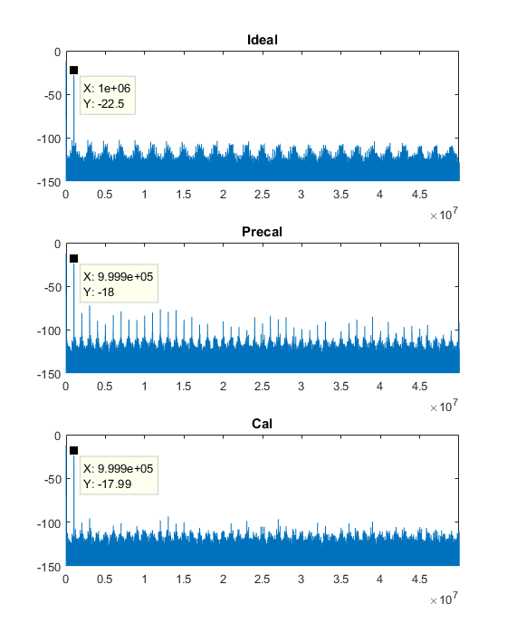
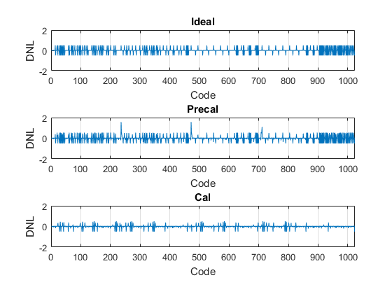
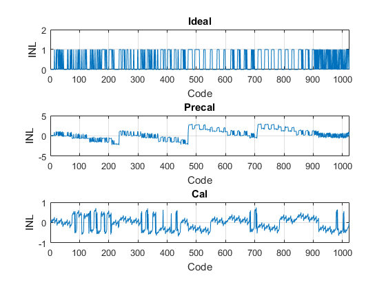
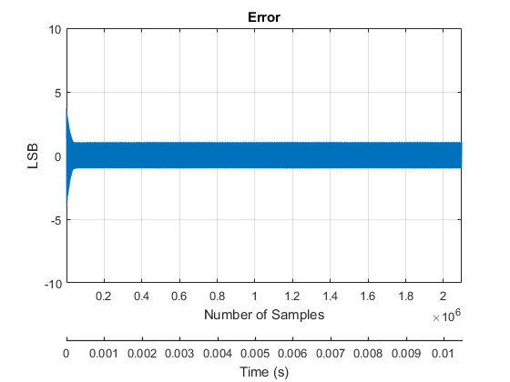
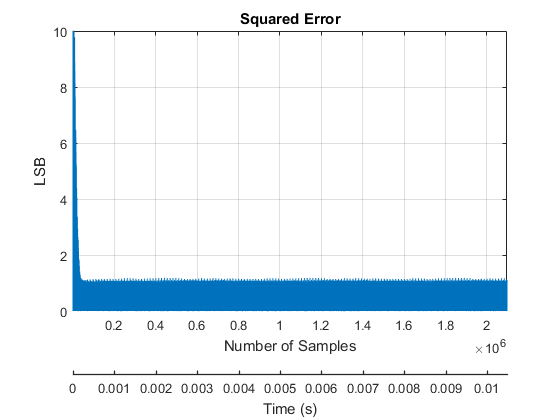
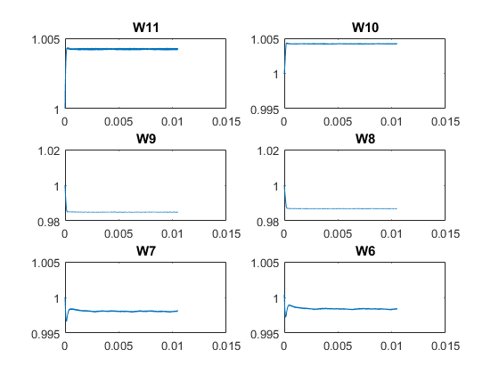

# matsar
Matlab script for performing LMSE calibration/nonlinearity measurements. There are two versions of matsar.
* **matsar_auto.m**: _automatically calculates required input frequency for coherent sampling [2]. It also calculates minimum samples needed for measuring DNL and INL correctly [1]. Use this if you don't know how to change parameters in the script. The run time of this script is slow due to large number of samples needed._
* **matsar_manual.m**: _this script does not calculate input frequency to guarantee coherent sampling. It allows users to specify simulation end time (tend) to allow faster convergence. Use this when you are doing layouts to validate redundancies._

## Useful Input Parameters

| Symbol    | Default Value  | Full Name                 |
|-----------|--------|---------------------------|
| F         | 1MHz   | Input Sine Wave Frequency |
| Fs        | 200MHz | ADC Sampling Frequency    |
| FullScale | 1.2V   | Full Scale Input Voltage  |
| N         | 10     | 10-bits ADC               |
| M         | 12     | 12 steps for redundancy.  |
| Cmin      | 1fF    | Unit capacitance		     |
| C_mask    | [array]| Used to toggle capacitors |
| Cpar_mult    | [array]| Apply multiplicative factor to each capacitor. |
| Cpar_add    | [array]| Apply additive factor to each capacitor. |
| Carray    | [array]| SAR capacitor array. |
| mu    | 1e-4 | LMSE training rate. Not applicable for 'AdaDelta'.|
| mode    | 'AdaDelta' | LMSE SGD method. Valid values are 'AdaDelta','AdaGrad' and 'Constant'.|
| Gamma    | 0.7 | Tuning parameter for AdaDelta. |

## Useful Output Parameters
Availabe in Workspace after running the script.

| Symbol    | Default Value  | Full Name                 |
|-----------|--------|---------------------------|
| F         | 999928Hz   | Input Sine Wave Frequency |
| Ts         | 5ns   | Sampling interval = 1/Fs. |
| tend         | 10.5ms   | Input Sine Wave end time. |
| Input         | [array]   | Input waveform. |
| nsampmin         | 1070679   | Number of samples required for DNL/INL measurements. See Doernberg [1]. |
| numsamp         | 999928   | Number of samples required for DNL/INL measurements. |
| W         | [matrix]   | Trained weights. |
| codes_ideal         | [array]   | Ideally converted codes. |
| codes_precal         | [array]   | Converted codes with mismatch. |
| codes_cal         | [array]   | Calibrated codes with mismatch. |
| Rdn         | [array]   | Redundancy at each conversion step. |
| Regs         | [matrix]   | Ideal register values. The nth row is the register for sample n. Each register is a M-element row vector.|
| Regs_mis         | [matrix]   | Mismatched register values. The nth row is the register for sample n. Each register is a M-element row vector.|
| sndrIdeal         | [scalar]   | Ideally converted SNDR. |
| sfdrIdeal         | [scalar]   | Ideally converted SFDR. |
| enobIdeal         | [scalar]   | Ideally converted SNDR. |
| sndrPrecal         | [scalar]   |  SNDR of converted code with capacitative mismatch (pre-calibration). |
| sfdrPrecal         | [scalar]   |  SFDR of converted code with capacitative mismatch (pre-calibration). |
| enobPrecal         | [scalar]   |  ENOB of converted code with capacitative mismatch (pre-calibration). |
| sndrPrecal         | [scalar]   |  SNDR of converted code with capacitative mismatch (calibrated). |
| sfdrPrecal         | [scalar]   |  SFDR of converted code with capacitative mismatch (calibrated). |
| enobPrecal         | [scalar]   |  ENOB of converted code with capacitative mismatch (calibrated). |

## Plot Controls

| Symbol    | Default Value  | Full Name                 |
|-----------|--------|---------------------------|
| Windowing         | 1   | 1: Blackman window. 0: Rect window. |
| ShowWeights        | 1 | Show weights convergence over time.|
| ShowError | 1   | Show error over time.  |
| ShowSE         | 1     | Show squared error over time.               |
| ShowWave         | 1     | Show time domain waveform  |
| ShowSpectrum      | 1    | Show frequency spectrum		     |
| ShowHistogram    | 1 | Show normalized code histogram. |
| ShowSNDR      | 1    | Show Signal-to-Noise-and-Distortion ratio.		     |
| ShowSFDR    | 1 | Show Spurious Free Dynamic Range. |
| ShowENOB    | 1 | Show effective number of bits. |
| ShowDNL    | 1 | Show Differential Non-Linearity. |
| ShowINL    | 1 | Show Integral Non-Linearity. |

## Sample Output
This sample output is the result of simulating a 12 steps 10-bit SAR ADC (default parameters) using "matsar_auto.m". Default parasitics are extracted from TSMC 65nm into the 'Cpar_add' array.

```matlab
Calculated input frequency is F=999928(Hz)
SNR(Ideal) = 61.911478
SFDR(Ideal) = 84.559386
ENOB(Ideal) = 9.991940
SNR(Precal) = 54.433850
SFDR(Precal) = 62.408115
ENOB(Precal) = 8.749809
SNR(Cal) = 61.504055
SFDR(Cal) = 81.749704
ENOB(Cal) = 9.924262
```
### Time Domain Waveforms


### FFT Spectrum


### Histogram


### Differential Non-linearity (DNL)


### Integral Non-linearity (INL)


### Error


### Squared Error


### LMSE Trained Weights



## References
[1] [J. Doernberg, H. -. Lee and D. A. Hodges, "Full-speed testing of A/D converters," in IEEE Journal of Solid-State Circuits, vol. 19, no. 6, pp. 820-827, Dec. 1984.](https://ieeexplore.ieee.org/abstract/document/1052232)

[2] [Wikipedia contributors. "Coherent sampling." Wikipedia, The Free Encyclopedia. Wikipedia, The Free Encyclopedia, 2 Jul. 2015. Web. 2 Mar. 2020.](https://en.wikipedia.org/wiki/Coherent_sampling)